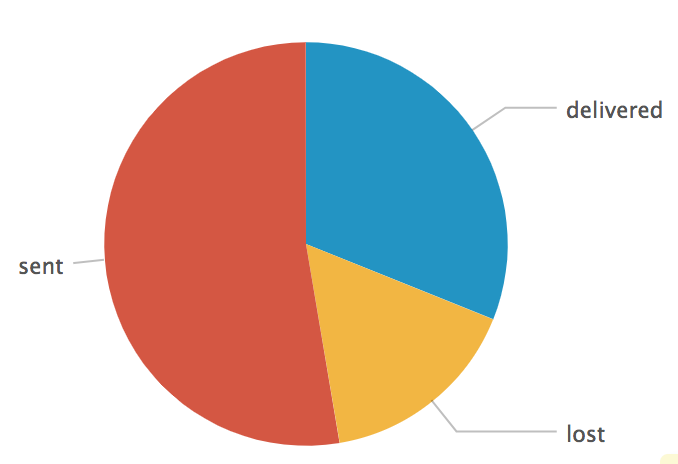
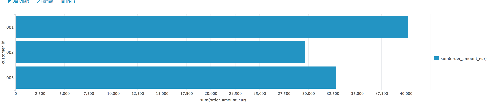

# Splunk business logging howto

This howto is about getting more insights from your logs. We approach this from two sides:

1. Providing searchable and meaningful meta data in your logs
2. Using a tool to filter the interesting bits of information out of the huge masses of logs we typically create

## A realistic business use case for advanced logging

Most logs are still a purely technical asset. You get informations about the server that caused a problem, about the thread that went berserk or the line of code that caused an issue. This is not really something a business or support person can work with.

So what we want to achieve is to additionally capture meaningful data of your domain model. As a widely known example we take a web based shop. Customers buy goods, checkout and pay. Later then the goods are delivered to the customer.

So typical things we want to track are:

- products
- customers
- orders
- invoices
- payments

For each of those there typically is a unique identificator. By adding this to the logs we can get for example insight into the status of an order process and thus can help various roles in the company with their job.

As an example take a call center employee who gets a call from a customer that wants to know about the delivery of his order.
Another case is a customer that got a reminder bill but he says he payed on a certain date. 

Wouldn't it be great if we could answer such questions not with specialized systems and custom integrations between systems but instead simply from the logs? 

So let's see what we can provide using the two changes I proposed at the start.

## Adding meta data using the Mapped Diagnostic Context (MDC)

Most logging frameworks allow to add key/value pairs to logging statements. As slf4j is the most common logging front end we take this as an example:

A typical log statement when a customer places an order might be:

```
LOG.info("Cutomer %s placed order %s", "12345", "0815");
```

This is nice if you directly read the log but it is difficult to search for this is a system that processes thousands of orders a day. 

So we can try to add meta data to the log statement to make it easier to find:

```
MDC.put("customer-id", "12345");
MDC.put("customer-name", "Christian Schneider");
MDC.put("order-id", "0815");
MDC.put("order-state", "placed");
MDC.put("order-amount-eur", 65.99); 
log.info("Cutomer {} placed order {}.", "12345", "0815");
MDC.clear();
```

So this statement is clearly a lot more verbose to write but it give us each attribute in an easily identifiable way. We will see later how it gives us completely new ways to search for and combine data.

If you look into a standard log file with the above statement you will see no difference. The reason is that by default the MDC 
values are not shown in the log. We will need to setup a special log layout or us ea special appender to show / process these informations.

## Using a log management system to make sense of your logs

Even if you have the meta data above it is difficult to find in the logs of a large system. The missing piece is to use a log management system to index, search and visualize your logs.

Two typical candidates for this are elastic search and splunk. As we use splunk at Adobe I will use it in the practical part but the same also works nicely for elastic search.

## Use a suitable log layout

The [splunk logging best practices](http://dev.splunk.com/view/logging/SP-CAAAFCK) mention that splunk likes key=value pairs. 
So we setup a log layout that includes all important standard attributes as well as all [MDC values](https://logback.qos.ch/manual/mdc.html).

For logback a suitable logger can look like this. `%mdc` prints all MDC values as key=value pairs.

```
  <appender name="file" class="ch.qos.logback.core.FileAppender">
    <file>target/test.log</file>
    <append>true</append>
    <encoder>
      <pattern>%date{ISO8601} level=%level thread=%thread logger=%logger sourcefile=%file line=%line %mdc message=%msg%n</pattern>
    </encoder>
  </appender>
```

## Set up local splunk instance

[Download and install splunk enterprise trial version]().

Be aware that splunk currently (Q1 2018) does not support Mac OS High Sierra. 
As a workaround edit the file etc/splunk-launch.conf and set

    OPTIMISTIC_ABOUT_FILE_LOCKING = 1

## Add file based input

In the splunk UI do settings / data input / files & directories / Add New.
Use the full path to the file target/test.log and let it be indexed to a new index "orders".

## Create a first search

Do a search in the splunk UI for 

    index="orders"

with time frame "one minute window". Make sure you set the mode to smart mode to discovery all fields.

## Some more ideas for searches

### Create a pie chart with delivery states

    index="orders"  | stats count by delivery_state



### Order amount by customer (bar chart)

    index="orders" | chart sum(order_amount_eur) over customer_id



### Get all orders of a customer

If you click one bar in the chart in splunk you get a search filtered by a specific customer

    index="orders" customer_id=001
